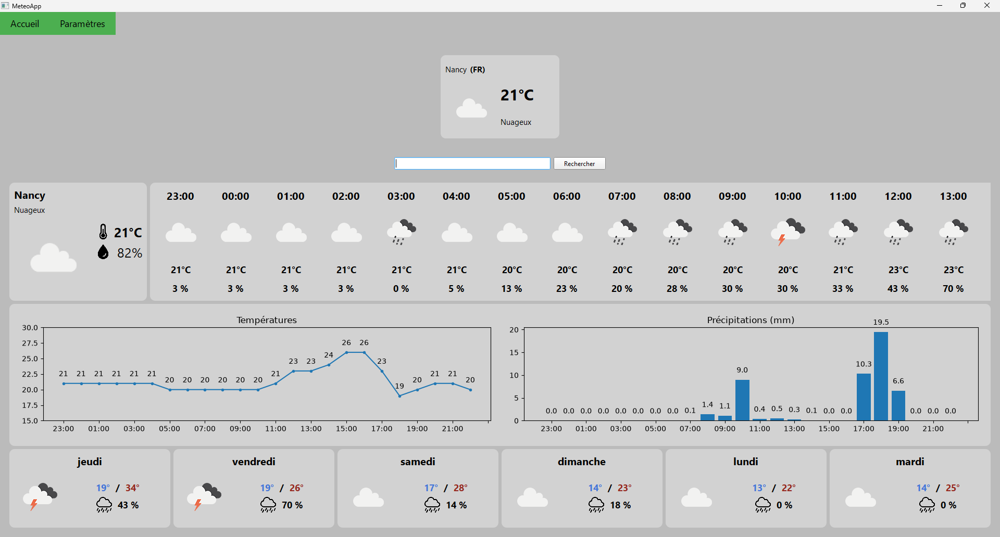
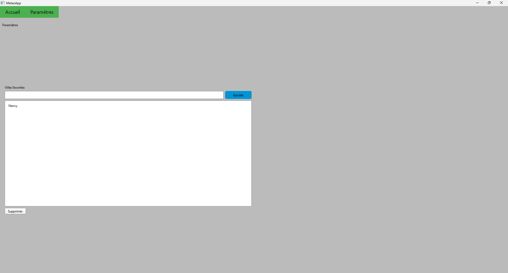

## Note :
L'exécutable n'a pas de signature numérique, Windows SmartScreen peut donc afficher un avertissement. Cliquez sur Informations complémentaires → Exécuter quand même. Le code source est disponible ci-dessous pour vérification.

## Installation : 
```
pip install -r requirements.txt
python main.py
```
